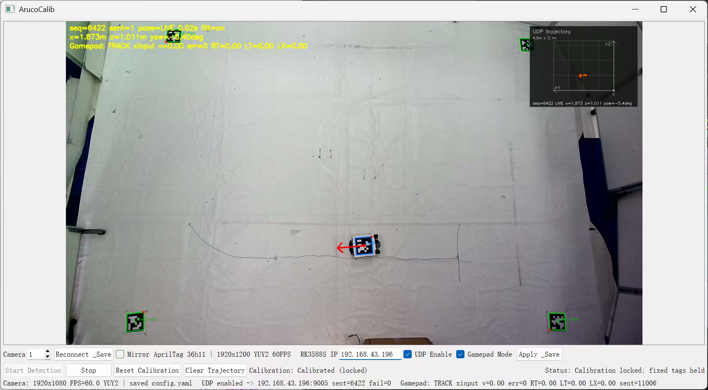
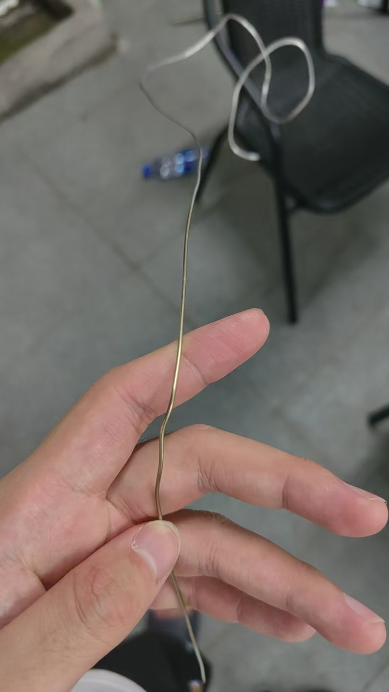
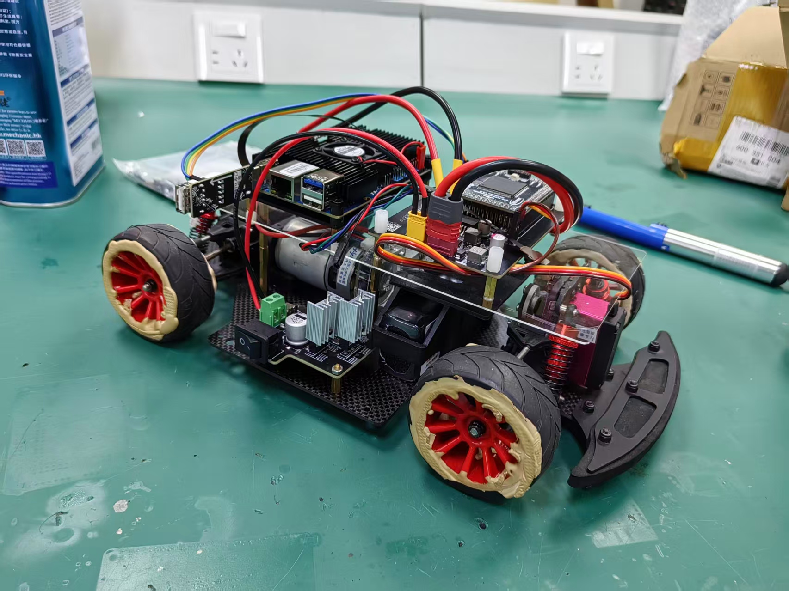
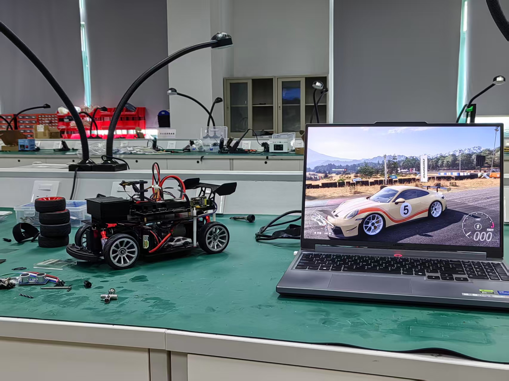
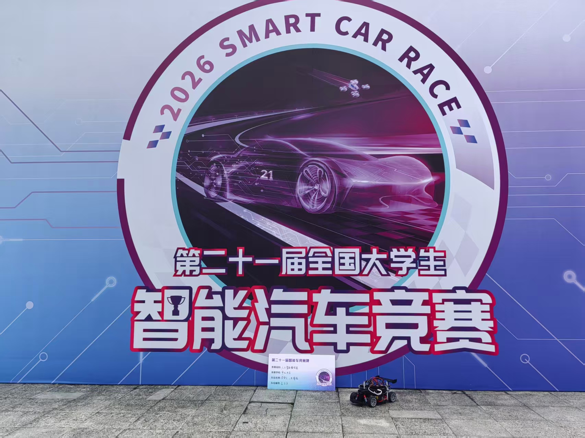

# SYSU_DDL
## **这份README大概率会比较长，但是也算是我这大半年来的踩坑总结了，所以如果能读完应该还是很有帮助的。个人认为这个仓库最核心的价值就在于定位系统，下位机的框架这些部分，上位机部分做的不是很好，所以更多的看我在这份README里面的总结吧**
本仓库为中山大学第 21 届智能车竞赛智能模型组 **DDL_大电流车队** 的软件及相关硬件工程仓库。

项目主要包含 **RK3588S 上位机视觉感知与任务决策、TC264D 下位机运动控制、场地视觉定位、硬件 PCB 设计以及 Windows 端辅助调试工具** 等内容。

简单来说，整个系统的主要部分采用经典的上下位机架构：

- **RK3588S 上位机**负责视觉感知、目标识别、定位以及任务决策；
- **TC264D 下位机**负责底层运动控制和执行；
- 二者通过通信接口交换控制指令与状态信息；
- 同时通过场地视觉标志物辅助完成全局定位（用于AR视频流的融合）

本仓库主要用于记录比赛期间的完整工程、方案演进过程以及赛后的整理与总结。

在2026.08.31，比赛结束约一个月后开始对仓库进行系统性整理。 很多代码和方案带有明显的比赛开发痕迹，并不一定是最优雅的实现 **（说实话一定不是）**
但基本保留了整个项目从开发、调试到最终比赛方案形成的过程。**整体实现大致如下：**

```text
                    摄像头 / 视觉输入
                           │
                           ▼
                    RK3588S 上位机
             
             │ 图像采集               │
             │ 目标检测 / 视觉感知     │
             │ 场地定位（用于AR视频流） │
             │ 任务状态判断            │
             │ 路径 / 行为决策         │
     
                           │
                上下位机通信（串口实现）
                           │
                           ▼
                     TC264D 下位机
        
             │ 电机 / 舵机控制         │
             │ 编码器数据采集          │
             │ PID 闭环控制            │
             │ 车辆运动控制            │
             │ 状态信息反馈            │
            
                           │
                           ▼
                      智能车执行机构
```
## 代码架构

目前仓库主要包含以下几个部分：

### `ArucoCalib-master/`（可复用，而且做的比较成熟了）

视觉定位与标定相关程序。

使用 **AprilTag**进行场地定位、坐标系建立以及视觉系统标定。主要用于AR视频流的融合而**不参与视觉元素的控制**。main分支下的定位系统由于早期全局摄像头每帧都要调整自动曝光导致帧数大概只要30帧左右，后期改进只自动曝光一次后保持曝光值就可以恢复到稳定60帧（可以自行修改）。考虑到实验室吊高问题，当时购买的是杰锐微通的全局快门摄像头，90°FOV，支持1080p，60FPS.实际使用发现90°FOV虽然能够保证低畸变，但在实验室吊高环境下难以拍摄到5x4m的环境，**建议后续改用120°FOV的镜头**。该定位系统的使用方法也很简单，毕竟已经直接打包成Windows的exe执行文件了，放在了dist目录下。打开执行文件后勾选相应的几个选项，定位坐标使用电脑端与板卡端进行UDP通信进行发送，为了方便调车我还做了手柄遥控功能，调试可以用到的exe文件在下面也会提到。具体exe界面如图所示：




### `Master_RK3588S/`（不建议复用，可考虑方案可行性）

RK3588S 上位机程序，也是整个智能车系统中最主要的视觉感知与任务处理模块。

主要功能包括：

- 摄像头图像采集；
- 目标检测与识别；
- 深度学习模型推理；
- 图像与视觉信息处理；
- 场地信息判断；
- 任务状态机与决策逻辑；
- 目标位置及运动信息计算；
- 与 TC264D 下位机进行通信。

比赛过程中使用 RK3588S 的 NPU 进行深度学习模型推理，在满足实时性的同时完成较复杂的视觉感知任务，整个系统中可以将 RK3588S 理解为智能车的 **“视觉 + 决策中心”**。在项目中我们使用的模型推理大概有两个阶段，初期使用了双rknn模型并行，包括对于赛道的语义分割模型和对于赛道元素的目标检测模型，事实证明这个方向在21届这个情况下有点难受，因为官方给的这个系统本质上就是个很粗糙的demo，在早期的时候完全做不到高FPS运行，常常只能顶着8-10FPS,推测是CPU占用的问题，后面也是针对这个问题进行了改进，不再选择多个模型并行，而是选择单个rknn模型执行。在智能车运行中对于赛道线的规划一般是采用cv逆透视再加上对于元素目标检测后进行贝塞尔拟合来做路径的规划，这个方向在21届还是可以做的但是据说在22届不让用cv做了因为要做泛化 **（说真的今年这么烂真有人明年愿意打百度的吗）**，所以我们也是刻意没有选择这个方向，转向高泛化的模型方案。但是初期方案是通过语义分割mask结果进行取列行中点再平滑处理来找到目标中线，这个方案在岔路会出现很难受的问题因为岔路的道路宽度会变宽导致中线这么取出来不准，于是第二版方案采用了热力图去通过模型来推理赛道中线，然后也是用了多任务模型来保证单rknn模型运行 **（前期被那个系统害惨了，PTSD了我说，实际上并行可能也是可以的，这个靠后人了罢）**。这个方案提出来都差不多六月了，也是遇上期末，一直拖到7月13才做出demo，距离比赛不到一周（笑），然后还遇上了数据集污染的问题，导致模型训练出来的结果有些令人忍俊不禁——当然也不排除是多任务模型的失衡问题。个人还是很看好热力图获取中线的方案的，不过数据量可能还是要多一些，然后我有看到群里有大蛇也是开源了自动数据标注工具，有这种东西感觉还是有点机会的，所以希望后人也可以考虑一下这个方案啊，如果时间充足的话。


### `Slave_TC264D/`（框架可以用，具体还需要细调）

TC264D 下位机控制程序。

主要负责智能车的底层运动控制，包括：

- 电机驱动；
- 编码器数据采集；
- 舵机控制；
- 运动状态获取；
- PID 等闭环控制；
- 上下位机通信；
- 执行 RK3588S 上位机下发的运动指令。

整体分工上：

> **上位机负责“看和想”，下位机负责“执行”。**

上位机根据视觉信息和任务状态生成期望运动行为，下位机负责将这些指令转化为稳定、实时的车辆运动。这个就没什么好说的了，MCU控制小车这种入队应该都会做的吧（应该吧）。


### `PCB_Schematic/`

智能车相关硬件原理图与 PCB 设计文件。

主要包含比赛过程中使用的部分控制、电源、接口以及外围电路设计。

该目录主要用于记录智能车底层硬件方案，便于后续：

- 硬件维护；
- 电路检查；
- PCB 复现；
- 接口关系查询；
- 后续方案改进。

**基本都能直接用，而且尽早把整车搭建好，板子基本上在寒假那段时间都可以做完的，然后把车先搭好吧，调调PCB就能用了**

### `Tools_Windows/`

比赛开发过程中使用的 Windows 端辅助工具。

主要服务于开发、调试和测试阶段，例如：

- 串口通信；
- 参数调试；
- 数据查看；
- 图像测试；
- 视觉系统辅助调试；
- 上下位机通信测试；
- 其他比赛期间临时编写的辅助程序。

该目录中的工具大部分并不是智能车比赛运行过程中必须部署的程序，而是用于提高开发和调试效率，看着用就好。


---

## 踩过的坑
-  **选题以及时间安排**：选赛题这一关应该是最重要的了 **（摊到今年百度这组算是享福了）**，校内选拔的时候应该都会有涉及各个part，选择自己感兴趣而且觉得能够有一定经验有思路的组别去做，然后在组队的时候就要能够有尽可能明确的分工，硬件/控制/视觉/机械，队长务必做好决策，确认好方案以及交付日期，队员也需要有交付能力和契约精神，在队长指定需要完成的日期前完成任务，否则很有可能会被某一环进度拖后腿 **（可以看看第三部分我们的项目发展历程）**，特别是模型组这样任务比较多的项目就务必要环环相扣，时间安排上也要尽可能给到足够宽裕的时间，一方面是给方案迭代做足准备，另一方面是课内压力，大二下实验课设还是不少的，所以要权衡好时间安排。智能车周期很长，所以尽量在赛题发布后选定组别：*2-3月把硬件机械部分结束，把车搭好；在4-5月时就要完成初步demo，后续再优化，这是比较理想的。*

-  **分工与协作**：像这类涉及多个部分的项目的话，一般队长就需要有一点“全栈”的能力，并不一定说各个环节都需要队长都去完全投入，这样效率很低，而是说需要有一个**能够拍板，有协调能力和号召力**的人去做这件事，能够把整体的架构定下来，给队员明确的分工，这样做起来才会顺利，同时队员也要尽可能不要孤立地去做自己的part，对于整体架构也要有一些认识，对于一些工具比如像我们今年这边的定位系统也要做到大家都能用，都会用，这样在沟通上就不会出现歧义/误解/障碍。

- **代码版本管理**：要有良好的版本管理习惯，队内最好能定一个SOP，在分支更新后提交合并到main分支，合作的时候不要太过于混乱，最好要用git来进行版本管理，而不要用文件传输的方式来做，那样很容易找不到备份，然后一定要在做好一个阶段性成果后就提交一次防止修改后效果变差。

- **关于AI的使用**：个人是不排斥用AI来做的，而且很多情况下用AI做效果也确实很好。在初期我们搭建框架的时候也是比较保守，会在AI写完后再人工review一遍，后面发现也很难再复核出什么差错，只有一些函数调用的问题出现，这个一般在编译环节也会报错所以我们后期也是因为时间很赶就没有review了（激进起来了）。**但是有几个问题需要注意一下**：1.不要重复造轮子。很多情况下完全让AI重新做一个功能很可能是完全达不到你的预期的，但事实上这个功能早就有很成熟的开源方案，这种情况下没有必要再去从头开始写，更合理的方法是去让AI参考着成熟的方案去做，而不是被带着走，人工需要有判断能力来做；2.可以用AI来判断自己的idea的可行性，但是不要盲目听信，综合考虑，这个需要做中学，形成一种直觉吧。在这个时代，不是说有了AI就什么都不用学习了，打个比方——*在这个时代，“拍摄”的门槛已经越来越低，但好的“导演”才是拍好一部电影的关键。*

- **技术交流与合作**：坦白说，我们的基础工作做的不是特别好，对于资源的传承没有有效的传递，有经验的队员难以给到下一届的同学引路和避坑，这个时候就很需要**跨校交流与合作**。在21届我们也是和华工的同学有很多交流，从早期定位方案的犹豫不绝，和华工交流后有了UWB方案和TAG两个备选，再到合作联调（其实有机会的话可以办那种校间的交流赛，作为建议）。总而言之，不要闭门造车，无论是问有经验的队员还是问友校的同学再或者是问相关方向的老师都是很好的选择，技术不是封闭的，交流才能更好进步，相信有技术积累的同学也不会拒绝交流的机会，所以可以和友校的同学们多交流。我们也是因为一些经验问题，调车的时候一直不太理想，直到最后才发现很长时间的延迟问题与串口的收发率有关，所以一定要多交流。

- **备件与余量**：在这么长的准备周期中，意外在所难免。所以无论如何都一定要有备用件，做到“手有粮心不慌”（笑）。从个人经验来看，准备至少3-5个备用板是有必要的，最好还能有一辆完整的备用车——烧了一块板如果只剩下一块，队员们还有信心准备吗，特别是在比赛前一晚的时候。这种事是真的发生过的，并非危言耸听，所以一定要做好备用，做足准备，毕竟明天和意外不知道谁会先来呢（）。

- **安全问题！！！**：无论是在实验室日常，还是出发比赛，安全问题都是最重要的。首先，锂电池是每个组都必不可少要接触的，每个进实验室的同学都要学习平衡充和锂电池的规范使用，知道突发情况下怎么应急处理，及时发现异常（如鼓包漏液等）并且妥善处置，实验室充电时也必须要有人员在场；其次，在进行焊接时候也要注意实验室通风，焊烟有毒，吸多了嗓子疼（），焊接结束后也要随手断电，不要长时间让烙铁/风枪/焊台等设备加热，务必随手断电！！！离开实验室也要检查断电情况；**还有亲历的安全细节也必须提一嘴，特别是像驱动这样的大功率板，一定要注意周围“导体”的存在，无论是铁丝，螺丝，螺母，在上电前最好都要注意！！！我们在比赛前一晚就是因为一个支撑铁丝碰到了驱动板，导致那块板子的H桥烧穿，只剩下一块板子，所以一定一定注意安全和备用件！！！看图吧**

<p align="center">
  
</p>


---

## 项目历程回忆录（实则*度批斗大会以及车队心酸史）
- 大二上寒假，大概1月-2月左右，确定了参加智能模型组这个组别，一开始还不知道这个组别今年大改革，从原来的完全模型组（实体赛道）到了今年的智能模型组（AR赛道），一开始也没有确认完整的赛题还有给硬件板卡，所以一直止步不前，同时早在2月份根据官方所说本组在21届提供X车模的购买，也就是说我们参赛不需要怎么考虑硬件，只要准备还软件部分即可，所以我们早期规划就是等寒假返校后第一时间先购买物资然后做demo。但是智能车是一个很草台的比赛，经过部分人（说句实话我觉得这些人也不打这个组别）的“卓大您好”反馈说这个组今年太烧钱打不起之后，在3月左右禁止了售卖官方车模，也禁售了官方定位系统，全部让我们自己做，美其名曰降低成本（实则试错成本就上去了），此乃一变。

- 三月返校，开始要准备硬件部分，这个时候祖传开始发力，我们搞到了下位机的PCB文件，应该是从22级传下来的，经过一些布局调整，再根据新的板卡准备了一块供电板之后，大概在4月中完成了打板和焊接调试等工作，在4月27日装好了初版车（如图）。硬件部分还算是比较顺利，**注意有一点就是要看好当年的规则要求，比如我们今年是要求了要在板子铺铜层要有信息字样，所以在准备的时候一定要注意这个，减少不必要的返工，我们今年也是很幸运没有出现这种问题。**

<p align="center">
  
</p>

- 四月底装车后也是被定位系统卡了好一阵子，首先是代码仓库搭建，先把ADS环境配好之后搭建了代码仓库，开始搭建下位机代码框架，在此期间一部分队员负责定位系统的制作，在确认好使用TAG方案之后也是一开始选择了智能视觉的定位，买了逐飞的OpenMV作为定位的摄像头，但是效果不是很好。到了下位机框架搭建差不多的时候需要进行验证和调试了，还是被定位卡住进度，定位一直没有有效的效果，AR视频流中虚拟元素一直不动。直到6月初才下定决定换摄像头重做定位，效果立竿见影，也是在和华工的交流下就用了不到3天就解决了定位问题，终于能够开展下一步。

- 六月定位解决以后发现推理帧数一直很低，导致延迟 *（现在看来和串口收发率也有点关系）*，但是好事是能跑，能够歪七扭八完赛了，也是士气大增（但是马上期末了有点力竭了）。然后就决定交流，找问题，看看是不是多个模型并行导致的CPU占用。在问了天大后发现他们用的是我们一直不看好的实例分割方案，也是用了一个简单的方法验证了，确实在改为单个模型后帧数有所提高，于是决定换方案，采用单模型推理的方式处理。六月底七月初的时候*度又开始发力，一口气整了两个活，一边说这个组不和区域赛一起举办，改为统一在上海举办，一边说改变赛题，取消原有的部分元素降低难度。距离比赛时间半个月了还没有确定比赛地点和比赛时间也是让我们备赛有点不知所措了。此乃二变。

- 比赛前几天，终于落地了新方案，但是效果远远达不到预期。在比赛出发前一天，遭遇了摄像头坏了和视角参数设置错误的问题，顿时感觉天都塌了。好在也是在出发前半小时将车调到了能完赛的水准，然后才前往了惠州。到了惠州第一天是调试赛，但是场地在体育馆内网络达不到官方定位系统的要求，所以整个车的视觉元素在那时都是漂的，完全看不出效果，导致调试的12分钟完全没有一点用，后续也是草草解决，给了6分钟时间重新调试，此乃三变。

- 到了第二天，又发现我们组采用的新系统存在兼容性问题，又要找办法解决，总之就是在惠州学院和酒店来回跑，一刻也不停，通宵调车，非常心累。更多细节可以看我的[小红书主页](https://www.xiaohongshu.com/user/profile/62fcceef000000000f006bb1)，有一些相关问题也可以私信我，也可以加我的微信联系。

### 最后也放上最终车模的照片，也希望中大智能车队越办越好吧

<p align="center">
  
</p>

<p align="center">
  
</p>